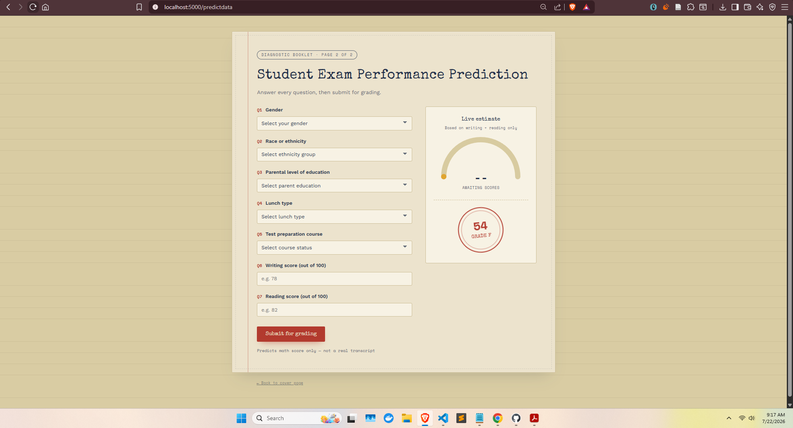

# Student Exam Performance Predictor

An end-to-end machine learning project that predicts a student's **math score** based on demographic and academic features, served through a Flask web application.

## Overview

This project follows a modular ML pipeline structure:

1. **Data Ingestion** — reads the raw dataset and splits it into train/test sets.
2. **Data Transformation** — builds a preprocessing pipeline (imputation, scaling, one-hot encoding) for numerical and categorical features.
3. **Model Training** — trains and evaluates several regression models, tunes hyperparameters via grid search, and saves the best-performing model.
4. **Prediction Pipeline** — loads the saved model and preprocessor to generate predictions for new input data.
5. **Web App** — a Flask app (`app.py`) with a simple form (`templates/home.html`) where a user can enter student details and get a predicted math score.

## Screenshot

<p align="center">
  
</p>

> Add a screenshot of the running app to a `photo/` folder at the project root, named `ss.jpg`, and it will render above.

## Dataset & Features

The model predicts `math_score` using:

**Numerical features**
- `reading_score`
- `writing_score`

**Categorical features**
- `gender`
- `race_ethnicity`
- `parental_level_of_education`
- `lunch`
- `test_preparation_course`

## Project Structure

```
mlproject-main/
├── app.py                          # Flask application entry point
├── setup.py                        # Package setup
├── requirements.txt                 # Python dependencies
├── .gitignore                      # Files/folders excluded from git
├── artifacts/                      # Saved data splits, trained model, and preprocessor
│   ├── data.csv
│   ├── train.csv
│   ├── test.csv
│   ├── model.pkl
│   └── proprocessor.pkl
├── notebook/                       # EDA and model training notebooks
│   ├── 1. EDA STUDENT PERFORMANCE.ipynb
│   └── 2. MODEL TRAINING.ipynb
├── photo/                          # Screenshots used in this README
│   └── ss.jpg
├── src/
│   ├── components/
│   │   ├── data_injection.py       # Data ingestion logic
│   │   ├── data_transformation.py  # Preprocessing pipeline
│   │   └── model_trainer.py        # Model training & selection
│   ├── pipeline/
│   │   ├── train_pipeline.py
│   │   └── predict_pipeline.py     # Inference pipeline used by the web app
│   ├── exception.py                # Custom exception handling
│   ├── logger.py                   # Logging configuration
│   └── utils.py                    # Shared utility functions
├── static/
│   ├── css/style.css               # App styling
│   └── js/script.js                # Live gauge + result animation
└── templates/
    ├── index.html                  # Cover page
    └── home.html                   # Prediction form / results page
```

## Models

The training pipeline evaluates the following regressors and automatically selects the best one based on R² score:

- Linear Regression
- Decision Tree Regressor
- Random Forest Regressor
- Gradient Boosting Regressor
- AdaBoost Regressor
- XGBoost Regressor
- CatBoost Regressor

## Setup & Installation

1. Clone the repository and navigate into it:
   ```bash
   git clone <repo-url>
   cd mlproject-main
   ```

2. Create and activate a virtual environment (optional but recommended):
   ```bash
   python -m venv venv
   source venv/bin/activate   # On Windows: venv\Scripts\activate
   ```

3. Install dependencies:
   ```bash
   pip install -r requirements.txt
   ```

## Usage

### Train the model

Run the ingestion pipeline, which triggers transformation and training end-to-end:

```bash
python src/components/data_injection.py
```

This saves the trained model and preprocessor to `artifacts/model.pkl` and `artifacts/proprocessor.pkl`.

### Run the web app

```bash
python app.py
```

Then open your browser at `http://localhost:5000` and go to `/predictdata` to fill in the form and get a predicted math score.

## Tech Stack

- Python, pandas, numpy, scikit-learn
- CatBoost, XGBoost, LightGBM
- Flask (web app)
- Jupyter Notebook (EDA & experimentation)

## Author

**Minhazul Islam Royel**